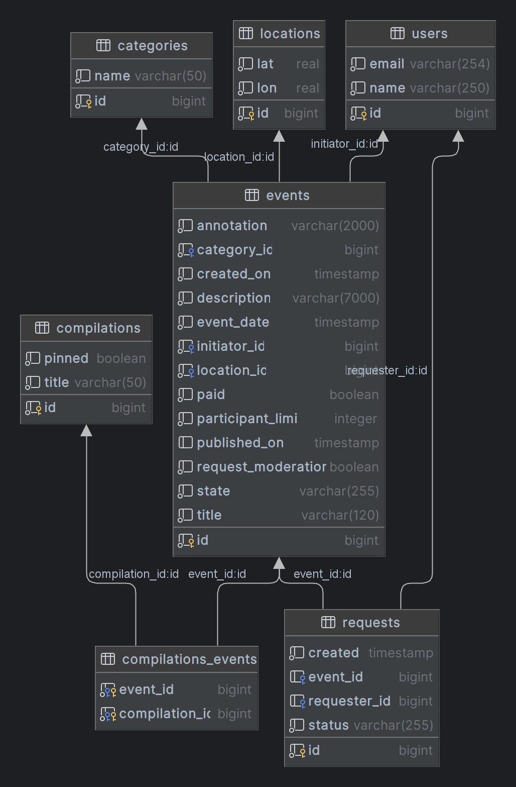

# java-explore-with-me

## Pull Request
https://github.com/nifrit85/java-explore-with-me/pull/5

# Идея

Свободное время — ценный ресурс. Ежедневно мы планируем, как его потратить — куда и с кем сходить. Сложнее всего в таком
планировании поиск информации и переговоры. Нужно учесть много деталей: какие намечаются мероприятия, свободны ли в этот
момент друзья, как всех пригласить и где собраться.

В этой афише можно предложить какое-либо событие от выставки до похода в кино и собрать компанию для участия в нём.

## Два сервиса

- Основной сервис содержит всё необходимое для работы продукта

- Сервис статистики хранит количество просмотров и позволят делать различные выборки для анализа работы приложения

## Основной сервис

API основного сервиса разделена на три части:

- Публичная будет доступна без регистрации любому пользователю сети;
- Закрытая будет доступна только авторизованным пользователям;
- Административная — для администраторов сервиса.

## Сервис статистики
Он собирает информацию о количестве обращений пользователей к спискам событий и о количестве запросов к подробной информации о событии.

## Спецификация API
- спецификация основного сервиса: [ewm-main-service-spec.json](ewm-main-service-spec.json)
- спецификация сервиса статистики: [ewm-stats-service-spec.json](ewm-stats-service-spec.json)

## Модель базы данных

## Использованные технологии

- Java 11
- Spring Boot
- Spring Data JPA
- Hibernate ORM
- REST API
- Docker
- Lombok
- PostgreSQL
- H2
- Maven
- Микросервисная архитектура